<div align="center">

# FABULA

**The agent harness that makes small local models finish hard tasks — and prove it.**

Frontier models sell confidence. FABULA ships proof.

[](LICENSE)
[](#try-it)
[](https://github.com/sergezuber/FABULA-LLM-5/releases)

[**Install**](#install) · [Docs](#docs) · [Receipt spec](docs/spec/verified-autonomy-receipt-v0.2.md) · [Plugins](docs/PLUGINS.md) · [Evals](docs/EVALS.md) · [Contributing](CONTRIBUTING.md)

</div>


## What is FABULA?

FABULA is an agent harness built on one bet: **reliability lives in the machinery around the model, not in the model.** Any LLM — local on your machine or a frontier cloud — slots into the socket as a swappable chip. Every step of the run is enforced by the engine, not by a prompt the model may ignore: the run cannot claim "done" without a green test run, cannot end before the request is fulfilled, and cannot quietly drift, loop, or quit.

Run it fully local and nothing leaves your machine. That is not a cost argument — it is the mode audited environments actually require, where a verified receipt from a model you own outranks an unverifiable claim from a model you rent.



## Why "FABULA"?

*Fabula* is Latin for "a story." Every agent you have used ends its hard tasks in one — a confident paragraph about work that may or may not exist. FABULA is built so that work cannot end in a story: a run finishes in exactly one of two honest states — **VERIFIED**, with a replayable receipt, or an explicit **NOT DONE** over the real failing output. The name is the failure mode; the product is its refusal.

## Every local-agent failure you know, refused by the engine

**"It said done, but nothing works."**
Done is a test result here. After a source edit the engine re-enters the turn until the project's own tests actually ran — in the run loop, not in a prompt.

**"It wrote a test that proves nothing."**
The harness runs the model's new test against the *pre-patch* code. Green there too? The reproduction is fake — done is refused. Breaks a sibling test? Regression — done is refused.

**"It quit halfway."**
Ending the turn is not the model's decision. An independent judge reads the real tool calls — not the model's summary — and refuses the stop until the request is fulfilled. A "done" is overridden outright when the measured trajectory (red verifies, unverified edits, rewinds) says otherwise.

**"It dug itself deeper."**
Two failed verifies in a row and the harness rolls every file back to the last green snapshot — its own shadow store, your `.git` untouched — and steers a different approach, with the recurring root cause named. Side effects a file revert cannot undo (an install, a migration, a POST) are flagged, not forgotten.

**"It looped on the same search."**
Byte-identical calls and near-duplicate queries are cut by the engine after a measured budget — and when a search turn is stopped, the harness itself delivers an honest "could not find it" listing what was tried, instead of a dead turn.

**"It drowned in context."**
The window belongs to one call — not to the conversation. Checkpoints carry the state across the ceiling, oversized material is held outside the context and read back in bounded slices, and the session outlives the window.

**"Agent harnesses burn 4× the tokens."**
This one cuts them. Per-step cost dropped **45%, measured on the wire**: the request prefix went from 72.3k tokens to under 40k, and it stays byte-stable within a task so the model's KV-cache survives across steps. That is why a small local model keeps up on a laptop.

## Don't trust it. Replay it.

Every fully-gated green run mints a **Proof-of-Done receipt**: the diff, the verify command, the model that sat in the socket, and a sha256 fingerprint of the exact context that produced the work — prompt prefix, tool schemas, router profile, request text, serving-model descriptor, optionally a real digest of the weight files on disk. No other shipped agent publishes this artifact as an open, replayable spec — if you know one that does, open an issue.

A real captured run is committed verbatim — replay it:

```bash
cd demo && fabula receipt verify
```

```
VERIFIED ✓ — the artifact replayed deterministically:
base c660a02ab138 + patch → `bun test` passed.
```

The harder one is public too: a real [SWE-bench Pro](https://github.com/scaleapi/SWE-bench_Pro-os) task, solved end-to-end by a local model on one consumer machine and graded by the benchmark's *hidden* acceptance suite — **100% of the hidden tests passed, verdict RESOLVED** — with a one-command Docker replay: [`docs/receipts/`](docs/receipts/).

The model didn't get smarter. The system around it refused to let "done" happen without proof.

The unedited artifacts behind it:

- [`refusal.cast`](docs/assets/refusal.cast) — the live terminal recording of the refusal (plays with asciinema)
- [`captured-run.svg`](docs/assets/captured-run.svg) — the same run rendered beat by beat
- [`HARDEST-JOURNEY.md`](docs/HARDEST-JOURNEY.md) — the worst day: repeated reds, an automatic rewind, a steered second opinion

The receipt format is an open specification any agent can implement — [verified-autonomy receipt v0.2](docs/spec/verified-autonomy-receipt-v0.2.md): JSON schema, field-by-field honesty rules, and a replay protocol. FABULA is its reference implementation: [`docs/GREENPAPER.md`](docs/GREENPAPER.md).

## What's inside

| Gate | What it refuses |
|---|---|
| **verify** | "Done" without a green run of the project's own tests — the engine presses the run back into verification by itself. |
| **reproduce** | A fix whose new test also passes on the pre-patch code (fake repro), or breaks a sibling (regression). |
| **quiz** | A change the agent cannot explain — graded against its own diff before done stands. |
| **attest** | A written deliverable that asserts more than its sources support — quotes re-found verbatim, numbers re-checked, "read all N files" checked against the run's own read log. |
| **judge** | A turn that ends before the request is fulfilled — with a hard veto when the measured trajectory contradicts the model's "done". |
| **rewind** | Digging the hole deeper — repeated reds roll the files back to the last green checkpoint, atomically. |
| **go floor** | A Go change whose own analysers were never asked — six of them run once on green, and a *reachable* vulnerability blocks while mere inventory does not. |
| **re-checking** | A receipt asserting more than its verification checks — every identity claim lands in exactly one named state: re-verified here, not checkable here, or mismatch. |
| **provenance** | Work of unknown origin — every receipt fingerprints the exact context that produced it. |
| **escalate** | Looping on a dead end — when measured evidence says another local attempt is not worth its cost, the harness itself fetches one cloud second opinion; the local model keeps driving. |
| **memory** | Memory you trust instead of check — a memory is bound to the code it came from and re-verified against your real tree before it is ever served back. Ships off by default; its decisions start in shadow until you have read them. |

Around the gates: web research, shell, sandboxed code execution, drift-tolerant file edits, browser automation, durable hand-offs, checkpoints and undo, and SSRF / redaction / injection defense.

Those guards cover **three doors, not one**: a rule that stops a tool also stops the same thing through the shell, and code without a container runs under the OS kernel profile. An agent asked to install a startup item will reach for all three — not to attack anything, but to finish its task.

The full map — 40 plugins, 89 tools: [`docs/PLUGINS.md`](docs/PLUGINS.md).

An optional **proof economy** builds on the receipt — publish to a content-addressed registry, cross-model witness attestation, a proof tree for team work. Off by default: [the disrupt layer](docs/PLUGINS.md#the-disrupt-layer--turning-a-proof-of-done-into-a-proof-economy-experimental-off-by-default).

## Install

**You need:** [LM Studio](https://lmstudio.ai) with a tool-calling model (or any OpenAI-compatible
endpoint), and `git`. Everything else — the engine, Bun, the localhost adapter, the plugin
dependencies — `setup.sh` installs for you.

### macOS — the desktop app

Apple Silicon plus the Xcode Command Line Tools (the engine build compiles a few native modules).

```bash
xcode-select --install   # once per machine; skip if you already build C/C++
```

```bash
git clone https://github.com/sergezuber/FABULA-LLM-5 && cd FABULA-LLM-5
./setup.sh
open FABULA-LLM-5.app
```

### Linux

The engine, every plugin and the desktop window run here; `setup.sh` builds all of it and packages
the window as a `.deb`.

```bash
git clone https://github.com/sergezuber/FABULA-LLM-5 && cd FABULA-LLM-5
./setup.sh
```

### Windows

`setup.ps1` is the same setup done the Windows way. Install **Git for Windows** first — the harness
runs every command through one POSIX shell on every platform, so the safety rules have a single grammar
to parse.

```powershell
git clone https://github.com/sergezuber/FABULA-LLM-5; cd FABULA-LLM-5
.\setup.ps1
```

Re-run `setup.sh` (or `setup.ps1`) any time — after a `git pull`, after installing a dependency. It never overwrites your `.env` or `fabula.config.json`.

### Point it at a model

**Local (default):** open LM Studio, load a tool-calling model, start its server. `setup.sh` already installed the localhost adapter the config points at — nothing else to do.

<details>
<summary><b>Any OpenAI-compatible endpoint</b> — a cloud provider or a corporate gateway</summary>

Put the key in `.env` (gitignored) and describe the provider in `fabula.config.json`:

```jsonc
// .env
MY_API_KEY=sk-...

// fabula.config.json
{
  "model": "myapi/my-model-id",
  "provider": {
    "myapi": {
      "name": "My endpoint",
      "npm": "@ai-sdk/openai-compatible",
      "options": { "baseURL": "https://llm.example.com/v1", "apiKey": "{env:MY_API_KEY}" },
      "models": {
        "my-model-id": { "tools": true, "limit": { "context": 131072, "output": 32768 } }
      }
    }
  }
}
```

The model must support **tool calling**, and `limit` needs both `context` and `output`. Check the endpoint and the exact model id with `curl -s https://llm.example.com/v1/models -H "Authorization: Bearer $MY_API_KEY"`.

</details>

### First run — the two-minute proof

A bug is planted in [`demo/`](demo/), and every test there is green anyway.

1. Open `demo/` as the project.
2. Paste: *Fix the export bug: the nightly export silently drops rows dated exactly on the end date. Prove it.*
3. Watch the machine refuse to finish until the proof exists.

You will see it write a test, watch that test fail on the old code, and only then call the work done — on your machine, with your model.

## Privacy

- Local models mean local data: nothing leaves the machine unless *you* configure a cloud provider.
- Deleting a chat purges its messages, artifacts, and caches — nothing is retained by the app.
- The app wipes WebKit caches on quit; secrets live only in gitignored `.env` / `*.key` files.
- No telemetry, no account, no phone-home.

## Docs

| Topic | Where |
|---|---|
| Every plugin and tool | [`docs/PLUGINS.md`](docs/PLUGINS.md) |
| The protocol (draft) | [`docs/GREENPAPER.md`](docs/GREENPAPER.md) |
| **The receipt spec — an open standard any agent can implement** | [`docs/spec/verified-autonomy-receipt-v0.2.md`](docs/spec/verified-autonomy-receipt-v0.2.md) |
| Public replayable receipts | [`docs/receipts/`](docs/receipts/) |
| Evals & run notes | [`docs/EVALS.md`](docs/EVALS.md) |
| The hardest journey (capability walkthrough) | [`docs/HARDEST-JOURNEY.md`](docs/HARDEST-JOURNEY.md) |
| Architecture deep-dive | [`docs/ARCHITECTURE.md`](docs/ARCHITECTURE.md) |
| Every dependency + install command | [`DEPENDENCIES.md`](DEPENDENCIES.md) |
| Configuration templates | [`fabula.config.example.json`](fabula.config.example.json) · [`.env.example`](.env.example) |
| Contributing & testing rules | [`CONTRIBUTING.md`](CONTRIBUTING.md) |
| Security policy | [`SECURITY.md`](SECURITY.md) |
| Credits | [`docs/CREDITS.md`](docs/CREDITS.md) |

## Acknowledgements

Built on and grateful to: [MiMoCode](https://github.com/XiaomiMiMo/MiMo-Code) (the engine FABULA builds on, an [OpenCode](https://opencode.ai) fork), [LM Studio](https://lmstudio.ai), [SearXNG](https://docs.searxng.org), [Playwright](https://playwright.dev), [Bun](https://bun.sh), piper, and faster-whisper. Several supervision mechanisms were adapted from the mechanism designs of [pi](https://github.com/earendil-works/pi) (Mario Zechner, MIT), reimplemented and tested here. The toolset follows naming and schema conventions that state-of-the-art assistants have made publicly familiar, implemented here independently for any model you choose to run. More: [`docs/CREDITS.md`](docs/CREDITS.md).

## License

MIT — see [LICENSE](LICENSE).
