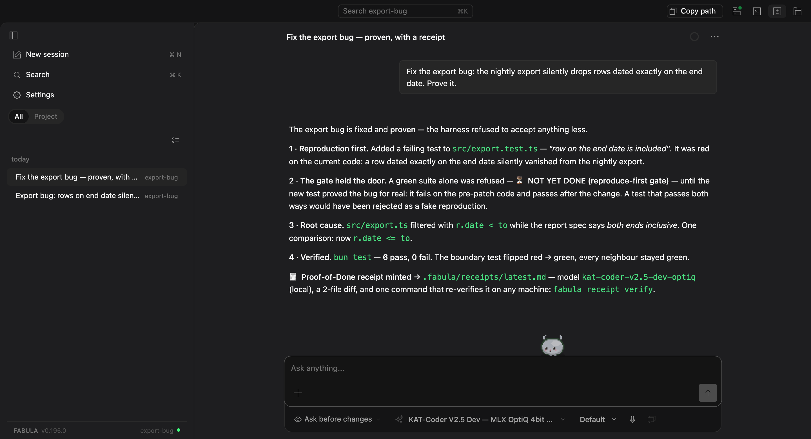

<div align="center">

# FABULA

**一套智能体框架：让小型本地模型做完困难的任务，并且拿出证明。**

前沿模型兜售自信。FABULA 交付证明。

[](LICENSE)
[](#安装)
[](https://github.com/sergezuber/FABULA-LLM-5/releases)

[**安装**](#安装) · [文档](#文档) · [凭证规范](docs/spec/verified-autonomy-receipt-v0.2.md) · [插件](docs/PLUGINS.zh-CN.md) · [评测](docs/EVALS.zh-CN.md) · [贡献指南](CONTRIBUTING.zh-CN.md)

[English](README.md) · [中文](README.zh-CN.md) · [Русский](README.ru.md)

</div>



## FABULA 是什么？

FABULA 是一套智能体框架，押的是一个赌注：**可靠性不在模型身上，而在模型周围的这套机器里。** 任何 LLM 都能像一枚可更换的芯片那样插进这个插槽 —— 跑在你机器上的本地模型也好，云端的前沿模型也好。运行的每一步由引擎来管，而不是靠一段提示词，因为提示词模型可以不理会：测试没跑出绿，这次运行就不能自称「完成」；请求没做完，它就不能收尾；它也别想悄悄跑偏、绕圈或者半路退出。

全本地跑起来，就没有任何东西离开这台机器。这不是在算成本账 —— 受审计的环境要的正是这种模式：一份凭证出自你自己拥有的模型，并且经过验证，它的分量高过租来的模型给出的一句无从核实的说法。


## 为什么叫「FABULA」？

*Fabula* 在拉丁语里是「故事」的意思。你用过的每一个智能体，困难任务到最后都收在一个故事上 —— 一段自信的文字，讲的那份工作可能存在，也可能根本不存在。FABULA 从设计上就不让工作以故事收场：一次运行只会落在两种诚实的状态之一 —— **已验证**，附一份可重放的凭证；或者摆着真实的失败输出，明确说 **未完成**。这个名字说的是失败模式，这个产品做的是拒绝它。

## 本地智能体的那些老毛病，引擎逐一驳回

**「它说完成了，可什么都跑不起来。」**在这里，「完成」就是一个测试结果。改过源码之后，引擎会一次次重新进入这一轮，直到项目自己的测试真的跑了一遍 —— 这件事发生在运行循环里，不在提示词里。

**「它写了一个什么都证明不了的测试。」**FABULA 会拿模型新写的测试，去跑*打补丁之前*的代码。那里也通过（绿）？那这个复现是假的，「完成」不算数。弄坏了旁边的测试？那是回归，「完成」照样不算数。

**「它干到一半就退出了。」**这一轮什么时候结束，不归模型决定。一位独立的裁判去读真实的工具调用，而不是模型自己写的摘要 —— 请求没做完，它就不放行这次停止。要是实测轨迹（失败（红）的验证、没验证过的改动、几次回退）说的是另一回事，那句「完成」直接作废。

**「它把坑越挖越深。」**连着两次验证失败，FABULA 就把每个文件回退到最近一次通过（绿）的快照 —— 快照放在它自己的影子存储里，你的 `.git` 一动不动 —— 然后引导它换一条路走，并点名那个反复出现的根本原因。回退文件撤销不了的副作用（装了个东西、跑了一次迁移、发了一个 POST），它会标出来，而不是放着不管。

**「它在同一个搜索上反复打转。」**逐字节相同的调用、以及近似重复的查询，超过实测出来的额度，引擎就把它掐掉 —— 而搜索这一轮一旦停下，FABULA 会自己给出一句诚实的「没找到」，把试过的东西列出来，不留下一个空转的轮次。

**「它被上下文淹没了。」**窗口属于一次调用，不属于整场对话。检查点把状态带过上限那条线，超大的材料放在上下文之外、按有界的切片读回来，会话活得比窗口更久。

**「智能体框架会烧掉 4× 的 token。」**这一套反而在省。每一步的成本降了 **45%，按真实发出的请求实测**：请求前缀从 72.3k token 降到 40k 以下，而且在一个任务内部逐字节稳定，模型的 KV 缓存因此能跨步骤活下来。小型本地模型能在笔记本上跟得住，靠的就是这个。

## 别信它。重放它。


每一次走完全部门禁、结果为绿的运行，都会签发一份 **Proof-of-Done 凭证**：diff、验证命令、当时坐在插槽里的那个模型，还有一枚 sha256 指纹，覆盖产出这份工作的那个确切上下文 —— 提示词前缀、工具 schema、路由配置档、请求文本、服务模型描述符，需要的话还包括磁盘上权重文件的真实摘要。已经发布的智能体里，没有第二个把这份产物做成开放、可重放的规范公开出来 —— 你要是知道有，请提一个 issue。

仓库里逐字提交了一次真实捕获的运行 —— 重放它：

```bash
cd demo && fabula receipt verify
```

```
VERIFIED ✓ — the artifact replayed deterministically:
base c660a02ab138 + patch → `bun test` passed.
```

更难的那一个也是公开的：一个真实的 [SWE-bench Pro](https://github.com/scaleapi/SWE-bench_Pro-os) 任务，一个本地模型在一台消费级机器上端到端做完，由该基准自己的*隐藏*验收测试集打分 —— **隐藏测试 100% 通过，判定 RESOLVED** —— 而且一条命令就能用 Docker 重放：[`docs/receipts/`](docs/receipts/)。

模型没有变聪明。是它周围这套系统不肯让「完成」在没有证明的情况下发生。

背后那些未经修饰的产物：

- [`refusal.cast`](docs/assets/refusal.cast) —— 这次拒绝的实时终端录像（用 asciinema 播放）
- [`captured-run.svg`](docs/assets/captured-run.svg) —— 同一次运行，一拍一拍渲染出来
- [`HARDEST-JOURNEY.md`](docs/HARDEST-JOURNEY.zh-CN.md) —— 最糟的一天：接连的失败（红）、一次自动回退、一次由框架引导的第二意见

凭证格式是一份开放规范，任何智能体都可以实现 —— [可验证自主性凭证 v0.2](docs/spec/verified-autonomy-receipt-v0.2.md)：JSON schema、逐字段的诚实性规则，还有一套重放协议。FABULA 是它的参考实现：[`docs/GREENPAPER.md`](docs/GREENPAPER.zh-CN.md)。

## 安装

**你需要 `git`，还需要一个模型** —— 跑在这台机器上的，或者你手头已有的 OpenAI 兼容端点。除此之外没有别的硬性要求。`setup.sh` 装好引擎、Bun 和四个 npm 包，凡是要占不小磁盘、或者要常驻一个后台服务的，它都先问你一句。

<details>
<summary><b>安装会问什么，每个回答又装了什么</b></summary>

先问模型从哪儿来。选「跑在这台机器上」，它装上 FABULA 与模型对话所用的本地适配器（模型本身你在 LM Studio 里自己下）；选「我已经有端点」，它什么都不多装，只告诉你要填哪两行；选「以后再说」，FABULA 照常启动，模型列表先空着。

接着是五项能力，每项都标了分量，也写清了什么情况下该拒绝：

| 能力 | 代价 | 什么时候不要 |
|---|---|---|
| 操作真实浏览器 | 约 539 MB（Chromium） | 你要的是写代码的助手。读网页有 `web_fetch`，它反正都装 —— 这一项是给那些非点不可的页面准备的。 |
| 搜索网络 | 一个本地 SearXNG | 机器不通网，或者你已经跑着一个，指过去更省事。 |
| 在容器里跑代码 | Docker Desktop | 代码照样能跑，由系统内核策略兜着（哪个平台有就用哪个）。Windows 上没有这层，所以那里容器是唯一的隔离。 |
| 语音朗读与听写 | 几百 MB 的模型 | 你并不打算跟它说话。别的功能都不依赖语音。 |
| Go 安全底线 | Go 工具链加五个分析器 | 你手上没有 Go 项目。仓库里没有 `go.mod`，这道底线一声不吭。 |

每个回答都能反悔：以后 `./setup.sh --with=browser` 就补上了。`--minimal` 只取内核、一句不问，`--all` 全都要；没有终端可问的场合它也绝不卡住 —— 装好内核，再说清跳过了什么。

</details>

### macOS —— 桌面应用

Apple Silicon，再加上 Xcode Command Line Tools（引擎构建要编译几个原生模块）。

```bash
xcode-select --install   # once per machine; skip if you already build C/C++
```

```bash
git clone https://github.com/sergezuber/FABULA-LLM-5 && cd FABULA-LLM-5
./setup.sh
open FABULA-LLM-5.app
```

### Linux

```bash
git clone https://github.com/sergezuber/FABULA-LLM-5 && cd FABULA-LLM-5
./setup.sh
bin/fabula serve --port 4096      # then open http://127.0.0.1:4096
```

引擎和每一个插件都能在这里跑。桌面窗口单独构建，打包成 `.deb`：`bash shell/build.sh`。

### Windows

先装 **Git for Windows** —— `setup.ps1` 和那些 shell 守卫都要有一个 POSIX shell，安全规则才只需要解析一种语法。命令派发给 PowerShell 的时候，引擎照样认得出来，守卫也会按 PowerShell 自己的规矩去解析它。

```powershell
git clone https://github.com/sergezuber/FABULA-LLM-5; cd FABULA-LLM-5
.\setup.ps1
bin\fabula.exe serve --port 4096   # then open http://127.0.0.1:4096
```

`setup.sh`（或者 `setup.ps1`）任何时候都可以再跑一遍 —— `git pull` 之后，装了新依赖之后。装好的引擎若已不带源码声明的版本，它会重新构建；带了就跳过，不白花时间。它绝不会覆盖你的 `.env` 或 `fabula.config.json`。

**更新已装好的一份：**`git pull && ./setup.sh`（只想重新构建就用 `./build.sh`），然后重新打开应用。先把它关掉 —— 构建会替换掉正在运行的那个引擎。

### 把它指向一个模型

**模型跑在这台机器上：**打开 LM Studio，加载一个支持工具调用的模型，把它的服务器启动起来。安装时你要是选了「跑在这台机器上」，配置里指向的那个本地适配器就已经装好了 —— 别的都不用做。当时选了别的、现在改主意了：`bun scripts/install-adapter-service.ts`。

<details>
<summary><b>任何 OpenAI 兼容端点</b> —— 云服务商，或者企业内部网关</summary>

把密钥放进 `.env`（已在 gitignore 里），然后在 `fabula.config.json` 里描述这个提供方：

```jsonc
// .env
MY_API_KEY=sk-...

// fabula.config.json
{
  "model": "myapi/my-model-id",
  "provider": {
    "myapi": {
      "name": "My endpoint",
      "npm": "@ai-sdk/openai-compatible",
      "options": { "baseURL": "https://llm.example.com/v1", "apiKey": "{env:MY_API_KEY}" },
      "models": {
        "my-model-id": { "tools": true, "limit": { "context": 131072, "output": 32768 } }
      }
    }
  }
}
```

模型必须支持**工具调用**，`limit` 里 `context` 和 `output` 两个都要有。端点和确切的模型 id，用 `curl -s https://llm.example.com/v1/models -H "Authorization: Bearer $MY_API_KEY"` 查一下。

</details>

### 首次运行 —— 两分钟的证明

[`demo/`](demo/) 里埋了一个缺陷，可那里的每一个测试照样是通过（绿）的。

1. 把 `demo/` 作为项目打开。
2. 粘贴这句话：*修复导出缺陷：每晚的导出会静默丢掉日期正好落在结束日期上的那些行。请拿出证明。*
3. 看着这台机器在证明拿出来之前不肯收工。

你会看到它写出一个测试，看着这个测试在旧代码上失败，然后才把这份工作叫做完成 —— 在你的机器上，用你的模型。

## 里面有什么

| 门禁 | 它拒绝什么 |
|---|---|
| **verify** | 项目自己的测试没跑出绿就宣称「完成」—— 引擎会自己把这次运行压回去重新验证。 |
| **reproduce** | 一个修复，它新写的测试在打补丁前的代码上也能通过（假复现），或者弄坏了旁边的测试（回归）。 |
| **quiz** | 智能体自己讲不清楚的改动 —— 「完成」成立之前，要对着它自己的 diff 打分。 |
| **attest** | 一份书面交付物，它断言的东西超出了引用的来源能支撑的范围 —— 引文要逐字重新找到，数字要重新核对，「N 个文件全读了」要拿本次运行自己的读取日志来对。 |
| **judge** | 请求还没做完就收尾的一轮 —— 实测轨迹跟模型那句「完成」对不上时，直接强制否决。 |
| **rewind** | 把坑越挖越深 —— 反复失败（红）之后，文件会原子性地回退到最近一次通过（绿）的检查点。 |
| **go floor** | 改了 Go 代码，却从没问过 Go 自己那些分析器 —— 一转绿就跑一遍，六个分析器；*可达*的漏洞会拦下来，只是躺在清单里的则不拦。 |
| **re-checking** | 一份凭证，它断言的东西超出了它的验证真正核查的范围 —— 每一条身份论断都恰好落进一个有名字的状态：此处已重新验证、此处无法核查、或者对不上。 |
| **provenance** | 来路不明的工作 —— 每一份凭证都给产出它的那个确切上下文留下指纹。 |
| **escalate** | 在死路上打转 —— 实测证据显示再试一次本地不值这个成本时，FABULA 会自己去云端要一次第二意见；主导权仍在本地模型手里。 |
| **memory** | 只信不查的记忆 —— 一条记忆绑定到它出处的那段代码，送回来之前先拿你的真实代码树重新验证一遍。默认随发布关闭；它做的决定先跑在影子模式里，等你读过再说。 |

门禁之外还有：网络研究、shell、沙箱化的代码执行、容忍漂移的文件编辑、浏览器自动化、持久的交接、检查点与撤销，以及 SSRF / 脱敏 / 注入防御。

这些守卫守的是**三道门，不是一道**：能拦住某个工具的规则，经由 shell 做同一件事时照样拦得住；而没有容器的代码，会跑在操作系统的内核配置档之下 —— 前提是这个平台有一个：macOS 上是 Seatbelt，Linux 上是 bubblewrap。Windows 没有逐条命令的内核禁闭，那里的隔离就交给容器后端，`execute_code` 会照实说明，而不是装作有。让一个智能体去装一个开机启动项，它三道门都会伸手试 —— 不是要攻击什么，只是要把任务做完。

完整地图 —— 40 个插件、90 个工具：[`docs/PLUGINS.md`](docs/PLUGINS.zh-CN.md)。

凭证之上还能再搭一层可选的**证明经济** —— 发布到内容寻址的注册表、跨模型的见证认证、给团队协作用的证明树。默认关闭：[disrupt 层](docs/PLUGINS.zh-CN.md#颠覆层把-proof-of-done-变成一套证明经济实验性默认关闭)。

## 隐私

- 本地模型意味着本地数据：除非*你*自己配了云提供方，否则没有任何东西离开这台机器。
- 删掉一个对话，它的消息、产物和缓存一并清除 —— 应用什么都不留。
- 应用退出时会清掉 WebKit 缓存；密钥只待在 gitignore 掉的 `.env` / `*.key` 文件里。
- 没有遥测，不用账号，不回传。
- 只有一个对外请求，而且可以关掉：FABULA 会问 GitHub 最新的发行版是哪个，好在侧栏亮起一个绿色箭头，
  提示有更新。关于你、你的机器、你正在跑的版本，一个字都不会送出去 —— GitHub 看到的只是一次普通的
  公开页面请求。在「设置 ▸ 通用」里关掉，关掉就是一次请求也不发。FABULA 自己从不下载、也从不安装任何东西。

## 社区

- **缺陷与提问** —— [GitHub Issues](https://github.com/sergezuber/FABULA-LLM-5/issues)
- **安全报告** —— 请私下提交，按 [SECURITY.md](SECURITY.zh-CN.md) 的办法
- **知道还有哪个智能体会签发可重放的凭证吗？** 提一个 issue —— 这份凭证规范写出来，就是给大家实现的。

## 文档

| 主题 | 位置 |
|---|---|
| 每一个插件和工具 | [`docs/PLUGINS.md`](docs/PLUGINS.zh-CN.md) |
| 协议（草案） | [`docs/GREENPAPER.md`](docs/GREENPAPER.zh-CN.md) |
| **凭证规范 —— 任何智能体都能实现的开放标准** | [`docs/spec/verified-autonomy-receipt-v0.2.md`](docs/spec/verified-autonomy-receipt-v0.2.md) |
| 公开的可重放凭证 | [`docs/receipts/`](docs/receipts/) |
| 评测与运行记录 | [`docs/EVALS.md`](docs/EVALS.zh-CN.md) |
| 最艰难的旅程（能力走查） | [`docs/HARDEST-JOURNEY.md`](docs/HARDEST-JOURNEY.zh-CN.md) |
| 架构深入 | [`docs/ARCHITECTURE.md`](docs/ARCHITECTURE.zh-CN.md) |
| 每一个依赖 + 安装命令 | [`DEPENDENCIES.md`](DEPENDENCIES.md) |
| 配置模板 | [`fabula.config.example.json`](fabula.config.example.json) · [`.env.example`](.env.example) |
| 贡献与测试规则 | [`CONTRIBUTING.md`](CONTRIBUTING.zh-CN.md) |
| 安全策略 | [`SECURITY.md`](SECURITY.zh-CN.md) |
| 致谢 | [`docs/CREDITS.md`](docs/CREDITS.zh-CN.md) |

## 鸣谢

本项目构建在以下项目之上，也向它们致谢：[MiMoCode](https://github.com/XiaomiMiMo/MiMo-Code)（FABULA 所基于的引擎，[OpenCode](https://opencode.ai) 的一个分支）、[LM Studio](https://lmstudio.ai)、[SearXNG](https://docs.searxng.org)、[Playwright](https://playwright.dev)、[Bun](https://bun.sh)、piper，以及 faster-whisper。其中若干监督机制参考了 [pi](https://github.com/earendil-works/pi)（Mario Zechner，MIT）的机制设计，在这里重新实现，并做了测试。这套工具集沿用了业界一流助手已经让大家熟悉的命名与 schema 约定，在这里独立实现，供你选择运行的任何模型使用。更多：[`docs/CREDITS.md`](docs/CREDITS.zh-CN.md)。

## 许可证

MIT —— 见 [LICENSE](LICENSE)。
