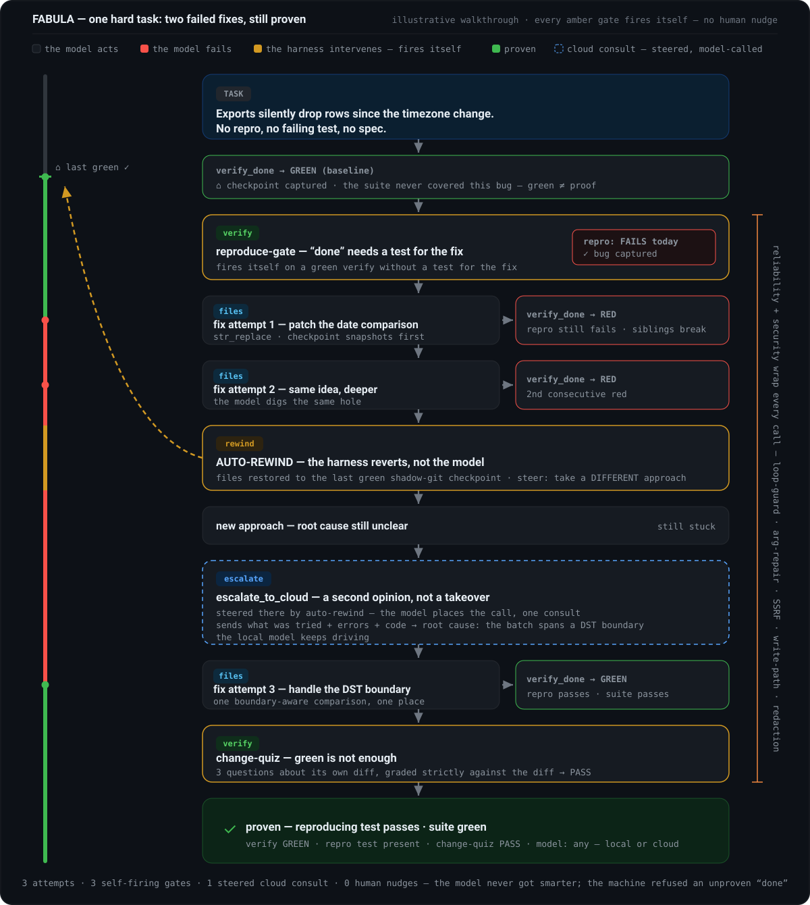

# 最难的一程——最糟的一天里，这套机器做了什么

[English](HARDEST-JOURNEY.md) · [中文](HARDEST-JOURNEY.zh-CN.md) · [Русский](HARDEST-JOURNEY.ru.md)

首页放的是一次**记录下来的真实运行**：真的录制，真的凭证。这一页讲的是另一件事——**完整的失败阶梯**，也就是运行比那还糟时会挨个触发的机制：验证一次次变红，文件自己回退，FABULA 自己去云端要一份第二意见。

> 这份走查是**能力演示**，不是一次记录下来的运行。里面每一道门禁都是已经发布的真实代码，随时可以打开来读，链接就在下面；只是这一整串顺序是我们特意拼出来的，好让整条阶梯装进一个故事里。真正记录下来的运行，在[首页](../README.zh-CN.md)和 [`docs/receipts/`](receipts/) 里。

## 这条阶梯，一级一级看

| 梯级 | 触发什么 | 代码在哪 |
|---|---|---|
| 变红 → 自我修复 | `verify_done` 把测试真实的失败输出交回来，模型照着它改 | [`plugin/fabula-tools.ts`](../plugin/fabula-tools.ts) |
| 绿了，但没有测试 | reproduce-gate 会把「完成」收回去，直到有一个测试真正跑过这次改动——改之前它失败，改之后它通过 | [`plugin/fabula-reproduce-gate.ts`](../plugin/fabula-reproduce-gate.ts) |
| 绿了，但没读懂 | change-quiz 拿智能体自己的 diff 考它 | [`plugin/fabula-change-quiz.ts`](../plugin/fabula-change-quiz.ts) |
| 连红两次（阈值可用 `FABULA_REWIND_THRESHOLD` 调整） | 自动回退把文件原子地恢复到最后一个通过的影子 git 检查点，再提示换一条路走 | [`plugin/fabula-rewind.ts`](../plugin/fabula-rewind.ts) |
| 还是卡住 | 提示指向 `escalate_to_cloud`——而且 FABULA 不等模型动手，自己就把它调起来：提示模型大可以不理，那就只算一个请求，算不上机制。于是从更强的模型那里取一次第二意见；主导权仍然在插槽里的那个模型手上 | [`plugin/fabula-escalate.ts`](../plugin/fabula-escalate.ts) |
| 过完全部门禁的绿 | Proof-of-Done 凭证自己签发出来 | [`plugin/fabula-receipt.ts`](../plugin/fabula-receipt.ts) |
