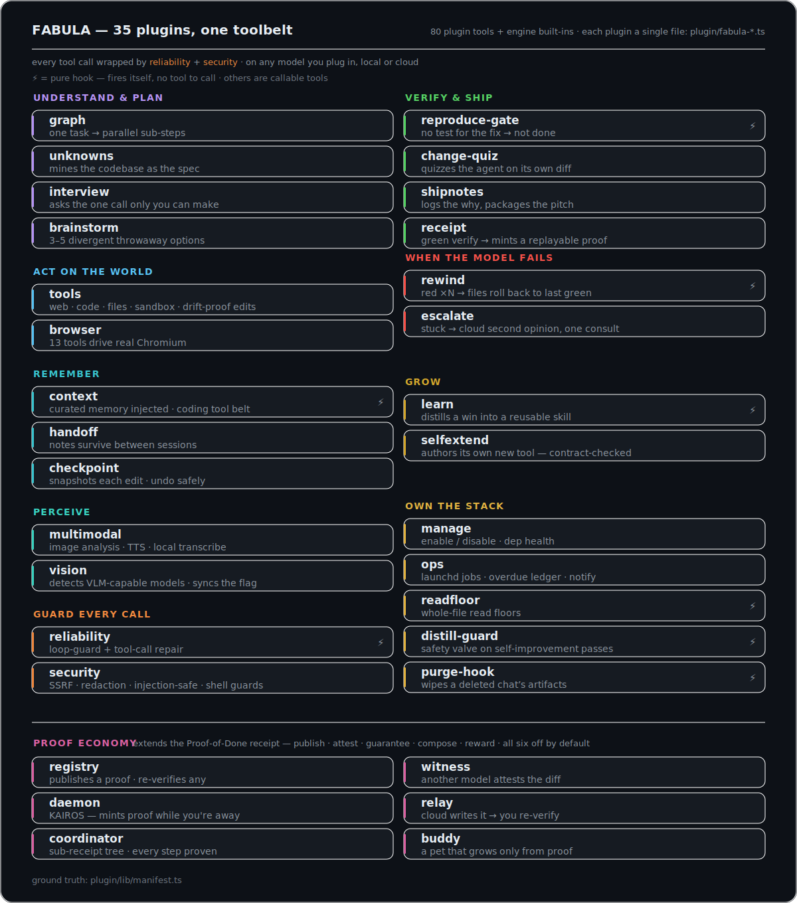

# FABULA plugins & tools — the full map

Every capability is a plugin: a single file (`plugin/fabula-*.ts`) with a declared manifest
([`plugin/lib/manifest.ts`](../plugin/lib/manifest.ts) is the source of truth). The tags in the app's
timeline **are** the plugins — same names everywhere: in `list_plugins`, in **Settings ▸ Plugins**, and below.

  

## What the system does

### It acts
Web fetch with clean extraction (HTML→Markdown, PDFs included), private web & image search, shell, sandboxed code execution, exact-match file editing, a real Chromium it can drive, image analysis, text-to-speech, transcription, weather, places, scheduled jobs, durable hand-off notes between sessions, and a workflow graph that runs independent sub-steps in parallel.

### It doesn't break
A loop-guard hard-stops the repeated no-progress calls weaker models fall into; malformed tool arguments are repaired on the fly, and exact-match edits fall back through a full unicode-drift matcher (smart quotes, any dash, non-breaking/ideographic spaces, BOM) so a near-miss still lands on the right bytes; the bundled `:1235` adapter normalizes reasoning-model quirks, watches the prefix cache and flags silent context-overflow. An optional coding tool belt masks the tools a coding task never uses, and every command's output is capped and spilled to a file with a cursor — so a giant test log can't blow the context window.

### It doesn't leak
SSRF guards on every outbound fetch, secret redaction in tool output, prompt-injection defense (untrusted web content is wrapped and isolated), command/approval guards on the shell.

### It learns
Curated notes and preferences load at session start; after you finish *and verify* a real multi-step change, it nudges you to distill that trajectory into a reusable skill. Skills and memory compound between sessions, entirely on-device.

### It forgets on command
Deleting a chat purges all of its artifacts; web caches are wiped on quit; no telemetry, no account. It learns what you let it and forgets what you delete.

## Plugin-by-plugin

| Tag | What it does |
|---|---|
| `verify` | **The heart of the harness.** `reproduce-gate` downgrades a green build to *not done* when source changed but no test runs the new path; `change_quiz` grades the agent against its own diff before "done" stands. Both fire themselves. *(`fabula-reproduce-gate`, `fabula-change-quiz`)* |
| `receipt` | Mints the Proof-of-Done receipt on a fully-gated green verify — model, gates, diff, verification, replay command. *(`fabula-receipt`)* |
| `graph` | **Plans and parallelizes.** `workflow_graph` breaks a request into up to 5 isolated sub-steps — each small enough for any model to hold — and runs independent ones in parallel. Opt-in router (`FABULA_ROUTER=1`) can escalate one heavy step to a cloud model: one step, never your codebase. *(`fabula-graph`)* |
| `unknowns` | **Closes the prompt↔codebase gap before coding.** `reference_hunt` reads working code as the spec; `surface_unknowns` lists what your ask doesn't say; `interview_me` asks the one decision only you can make; `brainstorm_prototypes` gives divergent options. *(`fabula-unknowns`, `fabula-interview`, `fabula-brainstorm`)* |
| `code` / `files` | **Executes, doesn't guess.** Guarded shell, sandboxed Python/JS, whole-file reads, exact-match `str_replace` edits that refuse to apply on a mismatch — no silent corruption. *(`fabula-tools`)* |
| `web` | Clean web fetch (HTML→Markdown, PDFs), private SearXNG search, live weather/places — no keys required. *(`fabula-tools`)* |
| `browser` | 13 tools drive real Chromium: navigate, click, type, screenshot, console, raw CDP. *(`fabula-browser`)* |
| `memory` / `handoff` | Curated memory injected at session start; structured, threat-scanned hand-off notes survive between sessions. *(`fabula-context`, `fabula-handoff`)* |
| `checkpoint` | Snapshots every file before the agent edits it, into a private git store — undo the agent even in a non-git project. *(`fabula-checkpoint`)* |
| `rewind` | **The harness reverts, not the model.** When each edit keeps the verify red, it rolls the files back to the last state that passed — atomically, from its own shadow-git — and tells the model to try a different approach instead of digging the hole deeper. *(`fabula-rewind`)* |
| `escalate` | **A second opinion when the local model is stuck.** `escalate_to_cloud` sends the same problem — what was tried, the relevant code, the errors — to a stronger cloud model and hands back a concrete root cause and next step, so a small model stops looping on a dead end. The model stays a swappable chip; the auto-rewind steer points it here when a rewound different approach also fails. *(`fabula-escalate`)* |
| `moa` | A second model cross-reviews the diff. *(`fabula-tools`)* |
| `voice` / `vision` | TTS (with zero-install macOS fallback), local Whisper transcription, image analysis with VLM auto-detection. *(`fabula-multimodal`, `fabula-vision`)* |
| `ops` | Real `launchd` scheduled jobs with an overdue-run ledger and native notifications. *(`fabula-ops`)* |
| `reliability` | Loop-guard hard-stop and on-the-fly tool-call repair. (The `:1235` adapter is a separate bundled component: [`proxy/lmstudio-adapter.py`](../proxy/lmstudio-adapter.py).) *(`fabula-reliability`)* |
| `security` | SSRF filtering, secret redaction, injection-safe wrapping of untrusted text, shell guards — wraps every tool call. *(`fabula-security`)* |
| `shipnotes` / `learn` | Auto-captured edit trail + deviation notes packaged into a reviewer-ready pitch; a nudge to distill verified wins into reusable skills. *(`fabula-shipnotes`, `fabula-learn`)* |
| `self-extend` | **The model grows its own tool belt.** `create_plugin` lets the model author a new tool when a capability is missing; the harness scaffolds it and enforces the one-plugin-per-file contract before writing — a self-authored plugin can never break loading. *(`fabula-selfextend`)* |
| `manage` + housekeeping | Enable/disable plugins with dependency health; whole-file read floors; auto-distill guard; full purge of deleted chats. *(`fabula-manage`, `fabula-readfloor`, `fabula-distill-guard`, `fabula-purge-hook`)* |

On/off state lives outside the repo (`~/.config/fabula/fabula-state.json` — the engine config dir; override with `FABULA_PLUGIN_STATE`, or use `FABULA_DISABLE=browser,ops`); a server restart applies changes.

## The disrupt layer — turning a Proof-of-Done into a proof economy (experimental, off by default)

The core harness ends a run by minting a **Proof-of-Done receipt** (`fabula-receipt`): the model, the gates, the diff, the exact verification command, a one-command replay. These six plugins build *on top of* that receipt — turning a private artifact into something you can **publish, independently attest, guarantee, compose, and be rewarded for**. Every one is `defaultEnabled:false`; enable them per-plugin in **Settings ▸ Plugins** or via `fabula-state.json`. Each keeps the harness's honesty discipline: nothing is faked, and a receipt is never modified after the fact.

| Tag | What it does |
|---|---|
| `registry` | **A public, content-addressed proof registry.** `publish_receipt` stores a receipt in a sharded git object store keyed by `sha256(patch + verify-cmd)` — the same fix + same check is the same id on any machine, so a proof can't be forged without changing what it proves — and can push it to a shared remote. `verify_receipt` re-runs the proof in a throwaway git worktree at the recorded base commit; `search_receipts` queries the local index. A public URL is only ever reported when a remote actually holds it. *(`fabula-registry`)* |
| `witness` | **Independent cross-model attestation.** `witness_diff` has a model of a *different* architecture adversarially review the diff (independence enforced: the witness can't be the author) → CONFIRMED / DISPUTED, recorded as a companion attestation next to the receipt (`.fabula/receipts/witnesses.json`) — the receipt itself is never touched. A green build says *the author's tests pass*; a witness says *someone else, who can't rubber-stamp, agrees*. *(`fabula-witness`)* |
| `daemon` | **KAIROS — a background posture that mints proof while you're away.** With `FABULA_DAEMON=1` it adds an honest work posture (cache-aware pacing, real `gh` PR-activity polling — no fake webhooks, terminal-focus awareness) so a long autonomous run keeps producing verified, receipted work between check-ins. The tick loop is the engine's (cron/wakeup); the plugin supplies the posture + tools. *(`fabula-daemon`)* |
| `relay` | **An escalation ladder that makes "guaranteed delivery" honest.** When the local model is truly stuck, `relay_to_cloud` has a stronger cloud model write the fix as a unified diff — which is **never trusted**: the local model applies it and re-runs the *same gates*. NOT DONE is a transit rung on a ladder (direct → rewind-retry → advice → with-hint → cloud-writes-it → need-input) bounded by attempt/cost/time budgets, so the run either reaches VERIFIED or asks you a precise question — it never quietly gives up or quietly lies. *(`fabula-relay`)* |
| `coordinator` | **Supply-chain provenance for a team of agents.** When work is split across workers (each a real engine subagent leaving its own receipt), `subreceipt_add` joins their receipts into a proof tree and `proof_tree` renders the honest composite: VERIFIED only if **every** worker's receipt is VERIFIED — a single NOT DONE anywhere makes the whole run NOT DONE. An SBOM for an agent trajectory: not just "the result is right," but "every step, by every worker, was proven." *(`fabula-coordinator`)* |
| `buddy` | **A companion that grows only from VERIFIED work.** A small ASCII pet whose look is deterministic from your user id (you can't hand-edit your way to a rarer one); it earns XP and levels **only** from receipts that *passed* — a NOT DONE receipt grows nothing. Gates bump matching stats, witnesses multiply the reward, and three published receipts each attested by ≥3 independent witnesses upgrade it to legendary — a badge you cannot fake. A silent hook feeds it on every green verify, so proof, not time, is what makes it grow. *(`fabula-buddy`)* |

Read together, the layer is a bet: if a local model's work can be **proven, published, independently witnessed, and composed**, then trust stops depending on which model produced it. *Any model in — proven work out.*

## Works with any tool-calling model

| Runtime / provider | How |
|---|---|
| **LM Studio** (local) | Default path — through the bundled `:1235` adapter, which fixes structured/tool calls for reasoning models |
| **Ollama & other local servers** | Should work via the same OpenAI-compatible `baseURL` path (not yet validated end-to-end) |
| **Any OpenAI-compatible cloud** | Add `baseURL` + key in `fabula.config.json` — the engine ships 100+ provider presets |
| **Corporate gateways (LiteLLM etc.)** | Strict single-system-message endpoints handled by `fabula-context` |

The base system prompt ([`system-prompt.example.md`](../system-prompt.example.md)) is original and model-agnostic — the public template you can build on. Copy it to `system-prompt.md` (the path the config's `instructions` point at) to run your own.
