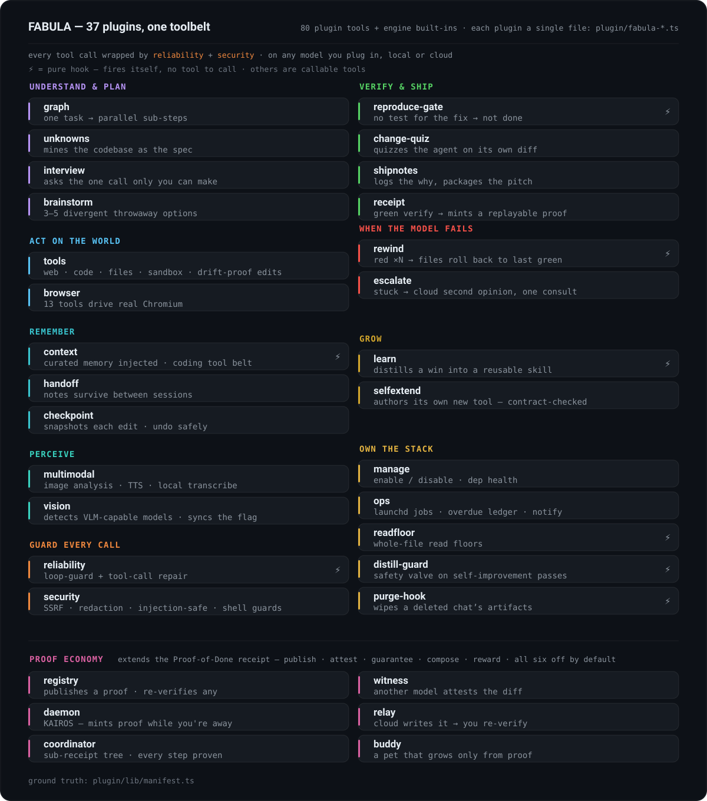

# FABULA 的插件与工具：完整地图

[English](PLUGINS.md) · [中文](PLUGINS.zh-CN.md) · [Русский](PLUGINS.ru.md)

每一项能力都是一个插件，也就是一个文件（`plugin/fabula-*.ts`），外加一份声明出来的清单——清单以 [`plugin/lib/manifest.ts`](../plugin/lib/manifest.ts) 为准。应用时间线上的那些标签**就是**插件本身，名字到哪儿都一样：`list_plugins` 里是它，**设置 ▸ 插件**里是它，下面这张表里还是它。

<p align="center">
  
</p>

## 这套系统做什么

### 它会动手

抓网页并干净地抽出正文（HTML→Markdown，PDF 也算）、私有的网页与图片搜索、shell、在沙箱里跑代码、精确匹配地改文件、一个它能真正驱动的 Chromium、图像分析、文本转语音、语音转写、天气、地点、定时任务、跨会话留得住的交接笔记，还有一张工作流图——彼此不相干的子步骤在图上并行跑。

### 它不会散架

- **循环直接切断，不迁就。** 逐字节相同的调用当场停掉；换个说法再搜一遍，第二次就拦住；同一轮里不同搜索的次数还有预算，用完就得给出综合结论。
- **差一点的编辑照样落地。** 工具调用的参数写坏了，框架当场修好；精确匹配的编辑还会落到一个专治 Unicode 漂移的匹配器上——弯引号、各种破折号、不换行空格、BOM，都认。
- **送往模型的这条通道有人把守。** 随附的 `:1235` 适配器抹平推理模型的各种怪癖，盯着前缀缓存，还会把静默发生的上下文溢出标出来。
- **输出撑不爆窗口。** 每条命令的输出都有上限，超出的部分连同一个续读游标写进文件，于是一份巨大的测试日志始终只是一份日志。

### 它不会泄漏

每一次对外抓取都要过 SSRF 守卫，工具输出里的密钥会抹掉，提示词注入有专门的防御——不可信的网页内容一律先包起来、隔开——shell 上还有命令与审批的守卫。

### 它会学

会话一开始就装载精选的笔记和偏好；等你真正做完一次多步改动、而且*验证*过了，它会提醒你把这条轨迹提炼成一个能复用的技能。技能和记忆在一次次会话之间越攒越厚，全程留在本机。

### 说忘就忘

删掉一个对话，它产生的全部东西一并清除；网页缓存在退出时抹掉；没有遥测，也不需要账号。你许它学什么，它就学什么；你删掉什么，它就忘掉什么。

## 逐个插件过一遍

| 标签 | 它做什么 |
|---|---|
| `verify` | **这套框架的心脏。** `reproduce-gate` 把新写的测试放回*打补丁之前*的代码树上跑一遍：加了改动通过、不加**也**通过，这个测试就是假的；而一次改动弄坏了旁边的测试，那是回归。两种情况都让这次构建停在*未完成*。「完成」要成立，`change_quiz` 先拿智能体自己的 diff 考它一遍。`attest` 门禁把同一套想法推到**书面**交付物上——一份分析、一份计划、一份调研摘要。三者都自己触发，不等谁来叫。[详情 ↓](#attest-门禁) *(`fabula-reproduce-gate`, `fabula-change-quiz`, `fabula-attest`)* |
| `go-audit` | **只管 Go 项目，在别处一声不吭。** 一次 Go 改动跑绿之后，六个分析器把这个模块扫一遍；结果不干净，就收回*完成*，并且逐条给出文件和行号。漏洞要**可达**才拦人——真的被调用，而不是只躺在 `go.mod` 里。[详情 ↓](#go-安全下限) *(`fabula-goaudit`)* |
| `receipt` | 一次验证跑绿、门禁全过之后，签发 Proof-of-Done 凭证：模型、门禁、diff、验证、重放命令，还有这次运行完整的上下文身份（[开放规范草案](spec/verified-autonomy-receipt-v0.2.md)）——提示词前缀的指纹、用户请求原文的哈希、当前服务模型的描述符（老实标明*这不是权重哈希*），以及在 `FABULA_WEIGHTS_DIGEST=1` 时，磁盘上权重文件的真实摘要。 *(`fabula-receipt`)* |
| `graph` | **先规划，再并行。** `workflow_graph` 把一个请求拆成最多 5 个互不干扰的子步骤，彼此独立的那些一起跑。步骤之间的那条边是一份契约：某一步什么都没产出，传下去的就是一个明确的*缺口*，绝不会是一段读起来像结果的文字；发生了截断，就说清截掉了多少；输出没法用，重试一次，还不行就标成空，好让合并那一步知道窟窿在哪儿。真要多个智能体一起干活，引擎自带的 `workflow` 工具才是完整的编排器。 *(`fabula-graph`)* |
| `unknowns` | **动手写代码之前，先把提示词和代码库之间的落差补上。** `reference_hunt` 把跑得通的代码当规范来读；`surface_unknowns` 列出你的需求里没说到的部分；`interview_me` 问出那个只有你能拍板的决定；`brainstorm_prototypes` 给几条各走各路的方案。 *(`fabula-unknowns`, `fabula-interview`, `fabula-brainstorm`)* |
| `code` / `files` | **执行，不猜。** 有守卫的 shell、跑在沙箱里的 Python/JS、整文件读取，以及精确匹配的 `str_replace` 编辑——对不上就拒绝落地，不会悄悄把文件改坏。 *(`fabula-tools`)* |
| `web` | 干净的网页抓取（HTML→Markdown、PDF）、私有的 SearXNG 搜索、实时天气与地点——一把密钥都不用。 *(`fabula-tools`)* |
| `browser` | 13 个工具驱动真正的 Chromium：导航、点击、输入、截图、控制台、原始 CDP。 *(`fabula-browser`)* |
| `memory` / `handoff` | 会话一开始就注入精选记忆；交接笔记有结构、过了威胁扫描，能一直留到下一次会话。另有一个锚定记忆的插件：凡是从一次已验证的轮次里写下的记忆，它都绑到那条记忆所讲的代码上，取用之前先用 git 对着你真实的代码树把这条绑定重新核一遍——代码要是已经往前走了，它要么把这条记忆扣住不给，要么干脆把当前的源码给你，绝不会贴一句「可能已过期」就递出去。这个插件默认关闭，而且它的晋升决定先走影子模式：只记账，不动手，直到你亲自读过它们。 *(`fabula-context`, `fabula-handoff`, `fabula-memory`)* |
| `offload` | **材料放在上下文外面，上下文里只留一个指向它的句柄。** 一个结果大到这一轮装不下，就整份留在对话之外，原地换成一小段说明。之后 `handle_query` 拿问题去问*整份*材料——由几个独立的子调用按窗口大小分片读，再把答案合到一起——所以什么都不会截断，也没有一点原始材料进上下文。想逐字看某一段，`handle_peek` 直接读。做这个判断时，比的是体积和模型的真实窗口，从不去看你怎么措辞。 *(`fabula-handle`)* |
| `corpus` | **一整本书，不必塞进一个上下文。** 要通读一整份语料时，FABULA 把这件事接过来做成一次 map-reduce：批次按模型的真实窗口切，每一批在一次隔离调用里归纳，摘要边做边落盘——中途断了是接着跑，不是从头再来——最后由这些摘要综合出一份报告。真正触发它的是*这件事的形状*（同一个文件夹里一个接一个的文件，超出了窗口，后面还有没读的），从来不是需求怎么措辞。 *(`fabula-corpus`)* |
| `window` | **上下文窗口是算出来的，不是手打上去的。** 换模型时，FABULA 读一遍模型自己的参数表和这台机器的内存，算出真正装得下的最宽窗口，照这个窗口把模型加载起来，再把后续每个决策所依据的那个数字一并改正。**机器已经占用了多少，是量出来的，不是假定的** —— 固定的预留值曾经批出过一个窗口，它的峰值比当时空闲的内存还多，于是对话一路长进这个窗口，直到整台机器卡死。没人量过的数，一律不信。 *(`fabula-window`)* |
| `context-budget` | 不让单独一轮胀到超出分给它的窗口。快到顶时，它逼智能体把读过的东西先归纳掉，别再抱着原始文本不放；碰上没有边界的「全都读一遍」，它会把路引到有界的批次加一份滚动摘要上。水位线以下它完全不动，所以平常的一轮逐字节照旧，一分代价也不付。 *(`fabula-ctxguard`)* |
| `checkpoint` | 智能体动手改之前，先把每个文件快照进一个私有的 git 存储——项目本身不用 git，照样能撤销它的改动。 *(`fabula-checkpoint`)* |
| `rewind` | **回退这件事由框架来做，不交给模型。** 当一次次编辑都让验证停在红色，它就把这些文件回滚到上一个通过的状态——原子地回，从它自己的影子 git 里取——然后引导换一条路走，而不是把坑越挖越深。失败的那些尝试会从模型的上下文里清掉，重试跑在干净的上下文上（重试一旦被污染，错误会成倍放大）；引导指令会点名反复出现的那个根因特征；回退掉的尝试留下的非幂等副作用——装包、迁移、发出去的网络调用——则明确标出：这些没能撤销。 *(`fabula-rewind`)* |
| `escalate` | **本地模型卡住时，去要一个第二意见。** `escalate_to_cloud` 把同一个问题——试过哪些办法、相关的代码、报出来的错——发给一个更强的云端模型，拿回具体的根因和下一步，好让插槽里的模型别再在死路上绕圈。模型始终是一枚可以更换的芯片；自动回退的引导会把它指到这里，而且连续几次红、评分够了，框架自己就会去调它（受 FABULA_ESCALATE_MAX 约束，终止开关是 FABULA_ESCALATE_AUTO=0），不必等模型换过一条路又失败之后再自己开口。 *(`fabula-escalate`)* |
| `moa` | 换第二个模型来交叉审这份 diff。 *(`fabula-tools`)* |
| `voice` / `vision` | 文本转语音（macOS 上还有一条零安装的回退路子）、本地 Whisper 转写、图像分析并自动探测可用的 VLM。 *(`fabula-multimodal`, `fabula-vision`)* |
| `ops` | 真正的 `launchd` 定时任务，配一本逾期运行的台账和原生通知。`list_scheduled` 是去问 **launchd** 到底加载了什么，而不是照着磁盘上的文件当真，所以一份 launchd 根本没听说过的残留 plist 会显示成 `NOT LOADED`，而不是一个已经生效的任务。 *(`fabula-ops`)* |
| `reliability` | 循环守卫的硬性中止，以及工具调用的即时修复。（`:1235` 适配器是另外随附的一个组件：[`proxy/lmstudio-adapter.py`](../proxy/lmstudio-adapter.py)。） *(`fabula-reliability`)* |
| `security` | SSRF 过滤、密钥脱敏、把不可信文本包成防注入的形式，再加上 shell 守卫——每一次工具调用外面都围着这一圈。同一套规则管住**三道门**：工具、shell，以及模型自己写出来的代码；只要平台有内核配置档，这类代码就跑在它下面（macOS 上是 Seatbelt，Linux 上是 bubblewrap；Windows 上由容器后端来做隔离）。 *(`fabula-security`)* |
| `shipnotes` / `learn` | 自动记下的修改轨迹加上偏离说明，打包成一份评审者拿来就能看的介绍；外加一条提醒，把验证过的成果提炼成能复用的技能。 *(`fabula-shipnotes`, `fabula-learn`)* |
| `self-extend` | **模型自己给自己加工具。** 缺了某项能力，`create_plugin` 就让模型自己写一个新工具；框架替它搭好骨架，并在落盘之前把「一个文件只放一个插件」这条契约钉死——它自己写的插件，绝不会把加载搞坏。 *(`fabula-selfextend`)* |
| `tool-router` | **给对的工具，不是给全部工具。** 每来一条真实的用户消息，它就确定性地把任务归到一个封闭的档位里（coding / web-research / full），只有这一档的工具 schema 会送到模型面前——每个请求里固定的预填充开销，大头正是工具 schema——同时这一组在同一个任务内保持逐字节不变，KV 缓存才活得下来。路由遮住的工具，按名字调用照样走影子分发执行：路由判断错了，代价是一次往返，绝不会把任务卡死。 *(`fabula-toolrouter`)* |
| `manage` + 日常维护 | 插件的启用与停用，附带依赖是否健康；一份容量报告，说清**这台**机器到底是什么（内存的类型和大小、核心数、加速器、内核约束、容器），以及由此推出了什么——窗口策略、同一时刻能有多少个调用抵达模型，每一项都注明这个数字从哪儿来；整文件读取的下限；一道守卫，在未审查的模型上拦下自动的自我改进流程（distill 和 dream 两条记忆整合）；以及把删掉的对话彻底清干净。 *(`fabula-manage`, `fabula-readfloor`, `fabula-distill-guard`, `fabula-purge-hook`)* |

开关状态存放在仓库之外（`~/.config/fabula/fabula-state.json`，也就是引擎的配置目录；想换路径用 `FABULA_PLUGIN_STATE`，想直接关掉用 `FABULA_DISABLE=browser,ops`）；重启服务后改动生效。

## 两道门禁的细节

### `attest` 门禁

*代码*算不算完成，由 `verify` 和 `reproduce` 说了算。`attest` 把同一把尺子交给书面交付物——一份分析、一份计划、一份调研摘要——那里没有测试可跑。

它把文本拆成一条条带类型的论断，再逐条重新推导：

- 一条**引文**，必须逐字出现在它引用的那份来源里（一句话确实存在，却挂到了错误的章节上，会被判成错误归属）；
- 一个**数字**，必须在来源里找得到；
- 像「N 个文件全都读过了」这类**过程**论断，拿这次运行自己的读取日志来对。

这道确定性的检查不花钱，只有没过这一关的论断才会送到一个隔离的模型面前，由它把忠实的转述和凭空编造分开。闲聊的轮次里它一声不响，出问题时选择放行，所以它绝不会否掉有依据的工作。它已经在一套植入了缺陷的基准上验证过（植入的编造条条抓到，零误报），也经过一次实机运行的检验。

### Go 安全下限

一次 Go 改动跑绿之后，这个模块自己的那几个分析器过一遍——`govulncheck`、`gosec`、`staticcheck`、NilAway、`go vet`、`golangci-lint`。结果不干净，就收回*完成*，并且逐条给出文件和行号。

**可达性是精度的那根杠杆。** 一个已知漏洞，要等到有问题的那个符号真的被调用才拦人——只是出现在 `go.mod` 里不算——所以某个依赖你根本没用，四条公告也挡不住你；而真有一条调用路径通到那里，它就挡。

在这些 linter 之上，`go_audit_criteria` 还查大约 30 条没有哪个 Go linter 判得了的审查准则：在事务里绕开事务、直接走连接池去读，goroutine 泄漏，被悄悄跳过的分支，没有上限的查询，Kafka offset 提交得太早，`sync.Pool` 里的对象没 `Reset` 就复用。凡是 linter 已经能抓的，一律声明为不在范围内；每一项发现都必须引用 diff 里的一个 `file:line`。

**想查什么，就装什么：**

```bash
brew install go golangci-lint
go install golang.org/x/vuln/cmd/govulncheck@latest
go install github.com/securego/gosec/v2/cmd/gosec@latest
go install honnef.co/go/tools/cmd/staticcheck@latest
go install go.uber.org/nilaway/cmd/nilaway@latest
```

每个分析器都可装可不装，而**少了哪一个，报告里都会点名**——一道单薄的下限，绝不能让人读成一道干净的下限。可达性只有 `govulncheck` 会报，少了它就等于根本没做 CVE 检查。在一个没有 `go.mod` 的仓库里，这个插件不动，也不花任何代价。

## 颠覆层：把 Proof-of-Done 变成一套证明经济（实验性，默认关闭）

核心框架在一次运行收尾时会签发一张 **Proof-of-Done 凭证**（`fabula-receipt`）：模型、门禁、diff、确切的验证命令，还有一条命令就能重放。下面这六个插件都建在这张凭证*之上*——把一件私人产物变成你可以**发布、请人独立认证、拿来担保、组合起来、并且因此得到回报**的东西。它们全都是 `defaultEnabled:false`；要用就在**设置 ▸ 插件**里逐个打开，或者改 `fabula-state.json`。每一个都守着框架的诚实纪律：不作假，凭证签发之后也绝不回头改。

| 标签 | 它做什么 |
|---|---|
| `registry` | **一个公开的、按内容寻址的证明注册表。** `publish_receipt` 把凭证存进一个分片的内容寻址存储（一棵文件树，键是 `sha256(patch + verify-cmd)`，用 git 做版本管理）——同一个修复配同一项检查，在哪台机器上都是同一个 id，所以想伪造一份证明，就得先改掉它所证明的东西——它还能把凭证推到一个共享的远端。`verify_receipt` 会在记录下来的基线提交上开一棵一次性 git 工作树，把这份证明重跑一遍；`search_receipts` 查本地索引。只有当远端真的收着它时，才会报出一个公开 URL。 *(`fabula-registry`)* |
| `witness` | **跨模型的独立认证。** `witness_diff` 请一个*不同家族*的模型来对抗性地审这份 diff（独立性卡在模型家族这一层：见证者不能和作者同出一脉）→ CONFIRMED / DISPUTED，作为一份伴随认证记在凭证旁边（`.fabula/receipts/witnesses.json`）——凭证本身一动不动。一次绿色构建说的是*作者自己的测试过了*；一位见证者说的是*另一个没法给你盖橡皮图章的角色也认可*。 *(`fabula-witness`)* |
| `daemon` | **KAIROS —— 一种在你不在场时照样签发证明的后台姿态。** 打开 `FABULA_DAEMON=1`，它就加上一套老实的工作姿态（看着缓存把握节奏、真去用 `gh` 轮询 PR 有没有动静——没有假 webhook——还知道终端焦点在哪儿），好让一次长时间的自主运行在你两次查看之间持续产出验证过、带凭证的成果。计时循环是引擎那边的（cron/唤醒）；插件出的是姿态和工具。 *(`fabula-daemon`)* |
| `relay` | **一个带预算的升级循环。** 插槽里的模型真卡死了，`relay_to_cloud` 就请一个更强的云端模型把修复写成统一格式的 diff——而这份 diff **一概不信**：由插槽里的模型来应用它，再把*同一批门禁*重跑一遍。循环受尝试次数、成本、时间三重预算约束，所以这次运行要么走到 VERIFIED，要么向你提一个精确的问题——它不会悄悄放弃，也不会悄悄撒谎。（完整的阶梯——自己干 → 回退重试 → 要建议 → 带提示 → 让云端来写 → 要你拍板——是设计图；真正接上线的那一级是 `relay_to_cloud`。） *(`fabula-relay`)* |
| `coordinator` | **给一支智能体团队做供应链溯源。** 工作拆给多个 worker 之后（每一个都是真正的引擎子智能体，各自留下自己的凭证），`subreceipt_add` 把这些凭证接成一棵证明树，`proof_tree` 把老实的合成结果画出来：**每一个** worker 的凭证都是 VERIFIED，整体才算 VERIFIED——任何一处 NOT DONE，整次运行就是 NOT DONE。这相当于一条智能体轨迹的 SBOM：说的不只是「结果对了」，而是「每一个 worker 的每一步，都拿得出证明」。 *(`fabula-coordinator`)* |
| `buddy` | **只有 VERIFIED 的工作才能把它养大。** 一只小小的 ASCII 宠物，长什么样由你的用户 id 确定性地决定（想靠手改换一只更稀有的，改不出来）；经验和等级**只**来自*通过了*的凭证——一张 NOT DONE 的凭证什么都长不出来。门禁会顶起对应的属性，见证者能把奖励翻倍，而三张已发布的凭证、每一张都有 ≥3 位独立见证者认证过，就把它升到传说级——一枚你伪造不来的徽章。一个静默的钩子在每次验证跑绿时喂它一口，所以让它长大的是证明，不是时间。 *(`fabula-buddy`)* |

这一层连起来读，是一个赌注：只要一个本地模型做出来的活儿能**拿出证明、公开发布、由别人独立见证、再拼装进更大的成果**，信任就不再取决于是哪个模型产出了它。*任何模型插进来 —— 产出可证明的工作。*

## 任何会调用工具的模型都能用

| 运行时 / 提供商 | 怎么接 |
|---|---|
| **LM Studio**（本地） | 默认路径——走随附的 `:1235` 适配器，它替推理模型抹平结构化调用与工具调用的差异 |
| **Ollama 及其他本地服务器** | 和 LM Studio 同一条 OpenAI 兼容的 `baseURL` 路径——端到端的验证运行还没做 |
| **任何 OpenAI 兼容的云** | 在 `fabula.config.json` 里填上 `baseURL` 和密钥——引擎自带一份很大的提供商预设目录 |
| **企业网关（LiteLLM 等）** | 只收单条 system 消息的严格端点，交给 `fabula-context` 处理 |

基础系统提示词（[`system-prompt.example.md`](../system-prompt.example.md)）是原创的，也不绑定任何模型——这是一份公开模板，你可以在它上面接着搭。把它复制成 `system-prompt.md`（配置里 `instructions` 指向的就是这个路径），跑起来的就是你自己那一份。
